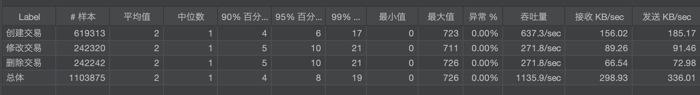
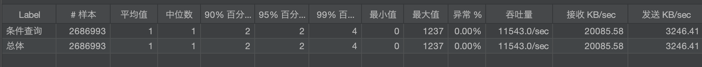

- Introduction:
  - The project needs Java 21 environment
  - The project is powered by Spring Boot, Spring Data JPA and H2 database
  - The project exposes REST APIs for the CRUD operations, and also provides Swagger UI for the APIs
  - The project is built using Maven
- Service information:
  - Listening port: 8080
  - Servlet path: /hsbc
  - H2 console path: /hsbc/h2-console
  - Swagger ui path: /hsbc/swagger-ui.html
- Unit tests script: 
  - src/test/java/com/hsbc/hsbc/test/TransactionServiceTest.java
- External dependencies:
  - Caffeine & Spring Cache: caches the data for faster access
  - Spring Data JPA: provides data persistence
  - H2 database: provides the in-memory database
  - SpringDoc OpenAPI: provides the Swagger UI
  - Spring Boot: the web service framework
  - Lombok: provides some basic annotations
  - Spring Test: unit test engine
- Deployment:
  - It is recommended to use docker to deploy the service
  - Run `package.sh` in folder `./deploy` to generate docker image
- Stress test:
  - The stress tests are conducted using jmeter, and you can find the project file `测试计划.jmx` in folder `./testing`
  - Results:
    - Create/Modify/Delete (Concurrency: 50 threads): 

    - Query (377k lines in database; Concurrency: 50 threads):
